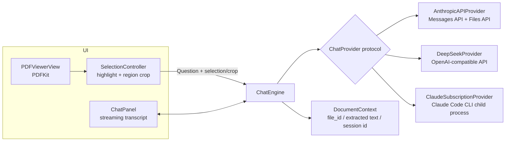

# claude-pdf — Design & Implementation Plan

A minimalist, smooth macOS PDF viewer with an AI side panel: highlight text or screenshot a region of the document and ask questions about it. Supports **Claude via your Pro/Max subscription** (no API key), **Claude via the Anthropic API**, and **DeepSeek via its API**. The PDF is attached once per document and treated like a cached "project"; each question is an independent conversation that reuses that cached document context.

---

## 1. Platform & stack decision

**macOS app, SwiftUI + PDFKit. iOS is deferred.**

This is constraint-driven, not arbitrary: the subscription path works by driving the locally installed Claude Code CLI as a child process, which is only possible on macOS. PDFKit also gives us a production-quality, smooth-scrolling PDF renderer for free — building a custom renderer is explicitly out of scope.

- **Language/UI:** Swift 5.10+, SwiftUI app lifecycle, macOS 14+ target.
- **PDF rendering:** PDFKit (`PDFView` wrapped in `NSViewRepresentable`). No third-party PDF engine.
- **Networking:** `URLSession` directly (there is no official Anthropic Swift SDK; raw HTTPS + SSE is the supported path for Swift). No heavy dependencies — the app should build with zero or near-zero SPM packages. **One package is taken:** [SwiftMath](https://github.com/mgriebling/SwiftMath) for LaTeX typesetting in chat answers (§6). The dependency-free alternative, KaTeX in a `WKWebView` per chat card, is heavier at runtime and cannot place math inline inside a SwiftUI `Text` run.
- **Persistence:** SwiftData (or plain JSON files) for per-document chat history; Keychain for API keys.
- **Distribution:** Developer ID + notarization, **outside the Mac App Store**. This is forced by the headline feature: the subscription provider spawns the user's `claude` CLI and relies on its stored OAuth login, which the App Sandbox (required for MAS) does not permit. A sandboxed build would have to ship with the subscription provider disabled.

---

## 2. Architecture overview



### Module layout

```
ClaudePDF/
  App/                    // app entry, window, settings scene
  Viewer/                 // PDFView wrapper, thumbnails, toolbar
  Selection/              // text selection + rect screenshot overlay
  Chat/                   // chat panel UI, transcript, citation chips
  Engine/                 // ChatEngine, DocumentContext, history store
  Providers/
    ChatProvider.swift    // protocol + capabilities
    AnthropicProvider/    // Messages API, Files API, SSE parsing
    DeepSeekProvider/     // OpenAI-compatible client
    ClaudeCodeProvider/   // CLI process wrapper
  Support/                // Keychain, OCR (later), logging
```

### The provider abstraction

Abstract at the **ask** level, not the HTTP level — the subscription provider isn't HTTP at all, it's a child process.

```swift
struct ProviderCapabilities {
    let supportsVision: Bool        // can accept a cropped screenshot
    let supportsNativePDF: Bool     // can ingest the PDF file itself
    let supportsCitations: Bool     // returns page-anchored citations
}

protocol ChatProvider {
    var capabilities: ProviderCapabilities { get }

    /// Called once per opened document. Uploads / extracts / warms whatever
    /// this provider needs, and returns an opaque handle stored on DocumentContext.
    func attach(document: PDFDocumentInfo) async throws -> DocumentAttachment

    /// One independent question. Streams deltas back.
    func ask(_ question: Question, in doc: DocumentAttachment)
        -> AsyncThrowingStream<ChatEvent, Error>
}

struct Question {
    var text: String
    var selectedText: String?       // from text highlight, with page number
    var regionImagePNG: Data?       // from rect screenshot (vision providers)
    var pageHint: Int?              // page the user is looking at
}

enum ChatEvent {
    case textDelta(String)
    case citation(pageNumber: Int, citedText: String)   // 1-indexed
    case usage(inputTokens: Int, cacheReadTokens: Int, cacheWriteTokens: Int, outputTokens: Int)
    case done
}
```

Capability matrix at launch:

| | Vision (crop) | Native PDF | Citations → jump-to-page |
|---|---|---|---|
| Anthropic API | ✅ | ✅ (document block / Files API) | ✅ |
| Claude subscription (CLI) | ✅ (file path to crop PNG) | ✅ (Read tool on the PDF) | ❌ (prompted page numbers only, best-effort) |
| DeepSeek API | ❌ (public API is text-only as of Aug 2026) | ❌ (extracted text) | ❌ (best-effort) |

---

## 3. The viewer (minimalist & smooth)

PDFKit gives "smooth loading/scrolling" essentially for free — the work is restraint, not rendering.

- `PDFView` with `displayMode = .singlePageContinuous`, `autoScales = true`, `displaysPageBreaks = false` for a seamless scroll. PDFKit renders pages lazily and handles zoom/trackpad momentum natively.
- Open via drag-drop, `⌘O`, and Finder "Open With". Restore last scroll position per document.
- Chrome: a single thin toolbar (page indicator, zoom, search, "Ask" toggle) that can auto-hide; optional `PDFThumbnailView` sidebar behind a toggle. Respect system light/dark.
- Chat lives in a **trailing side panel** (`HSplitView` / inspector style), collapsible, so the document stays the hero.
- Search: `PDFDocument.findString` wired to `⌘F` with match highlighting (PDFKit built-in).

Explicit non-goals: annotations/editing, custom page-rendering pipeline, tabs (single window per document via the document architecture is enough).

---

## 4. Selection: highlight and region screenshot

Two input modes, both ending in a `Question`:

**A. Text highlight (default).** Use PDFKit's native text selection. On "Ask about selection" (context menu, `⌘L`, or a floating button near the selection):
- `pdfView.currentSelection` → `selection.string` plus the page number(s) from `selection.pages`.
- Optionally drop a temporary `PDFAnnotation` highlight so the user sees what the question is anchored to.
- The selection text + page number go into `Question.selectedText`.

**B. Region screenshot (for figures, tables, equations).** A crop mode toggled from the toolbar (or `⌘⇧A`):
- A transparent overlay `NSView` on top of the `PDFView` captures a drag rectangle.
- Convert view coords → page coords with `pdfView.convert(rect, to: page)`. *(Known fiddly spot: PDF page space is bottom-left origin and zoom-dependent — isolate all conversion in one tested helper.)*
- Render the crop by drawing the `PDFPage` into a `CGContext` clipped to the rect at **2× scale**, export PNG. Keep crops under ~1600 px on the long edge to control image-token cost.
- PNG goes into `Question.regionImagePNG`. For text-only providers (DeepSeek), also run `page.selection(for: rect)?.string` so there's a text fallback; if the region has no text layer, show "This provider can't see images — switch to Claude for visual questions."

---

## 5. Context model: "PDF cached like a project"

The user-visible model: **attach the document once; every question is a fresh, independent conversation that shares the document as a cached prefix.** No chat history is sent between questions (a later "thread mode" can opt into history).

The implementation per provider differs, but all three follow the same rule that makes caching work: **stable content first (frozen system prompt + document), volatile content last (the question, the crop).** A byte-identical prefix across questions is what turns the document into a "project."

### 5.1 Anthropic API path (the reference implementation)

*Why this provider exists at all (the request named subscription-Claude and API-other-model): it is the only path that returns real page-anchored citations, it is the cleanest expression of the caching model the other two approximate, and for users without a Pro/Max subscription it is the only way to reach Claude. It is also why it is built first — it de-risks the whole context design before the less-documented CLI leg.*

**Attach (once per document):**
1. Upload the PDF via the Files API — `POST /v1/files` with `anthropic-beta: files-api-2025-04-14` → keep `file_id`. (Upload once; never re-send PDF bytes per question.)
2. Optionally pre-warm the cache (see §7).

**Ask (every question, independent):**

```jsonc
POST /v1/messages   // headers: x-api-key, anthropic-version: 2023-06-01,
                    // anthropic-beta: files-api-2025-04-14
{
  "model": "claude-opus-5",            // default; picker also offers claude-sonnet-5 / claude-haiku-4-5
  "max_tokens": 16000,                 // Opus 5 thinks by default and thinking counts against this
  "output_config": { "effort": "medium" },   // latency lever; not part of the cached prefix
  "fallbacks": "default",              // re-serve a refused question instead of an empty bubble
  "stream": true,
  "system": [{ "type": "text", "text": FROZEN_SYSTEM_PROMPT }],   // never interpolate anything dynamic
  "messages": [{
    "role": "user",
    "content": [
      {
        "type": "document",
        "source": { "type": "file", "file_id": FILE_ID },
        "title": "<filename>",
        "citations": { "enabled": true },
        "cache_control": { "type": "ephemeral", "ttl": "1h" }     // ← the "project" cache breakpoint
      },
      // everything below the breakpoint varies per question and never invalidates the cache:
      { "type": "text", "text": "The user selected this on page 12: \"…\"" },   // if any
      { "type": "image", "source": { "type": "base64", "media_type": "image/png", "data": CROP } },  // if any
      { "type": "text", "text": USER_QUESTION }
    ]
  }]
}
```

Why this shape:
- **Prompt caching is a prefix match.** System prompt + document block are byte-identical on every question, so question 2..N read the document from cache (~0.1× input price) instead of re-processing it. The question/selection/crop sit *after* the `cache_control` breakpoint, so they never invalidate it.
- **First question** pays the cache write (2× at 1-hour TTL); every subsequent question within the TTL pays cache-read prices. Verify in `usage.cache_read_input_tokens` — if it's 0 on question 2, something is mutating the prefix (this is the #1 bug class; keep the system prompt literally a constant).
- **Citations** (`citations: {enabled: true}`) make responses return `page_location` citations (`start_page_number`, 1-indexed) attached to text blocks. Render each as a clickable chip in the chat panel that scrolls the `PDFView` to that page — the single strongest product feature for a PDF reader, nearly free.
- **Streaming:** parse SSE `content_block_delta` events — `text_delta` for text, `citations_delta` for citation attachments. Surface tokens immediately.
- Handle `stop_reason == "refusal"` before reading content (Opus 5 safety classifiers), and surface a readable error rather than an empty bubble. `"fallbacks": "default"` (beta `server-side-fallback-2026-07-01`) additionally lets the API re-serve a refused question on its recommended fallback model; drop the parameter and the beta together to disable.
- **Adaptive thinking is on by default on Opus 5** and its tokens count against `max_tokens`, so the cap is 16000, not 4096. `thinking` is left unset; `display` defaults to `"omitted"`, so the stream carries empty `thinking` blocks — the SSE parser must skip unknown block/delta types (`thinking_delta`, `signature_delta`, `ping`, `fallback`) rather than switch exhaustively.

**Model default:** `claude-opus-5` (current Opus, $5/$25 per MTok). Settings expose `claude-sonnet-5` (cheaper) and `claude-haiku-4-5` (cheapest, 200K context / 100-page doc cap).

### 5.2 DeepSeek API path

OpenAI-compatible endpoint at `https://api.deepseek.com/chat/completions`. Current models: **`deepseek-v4-flash`** (default: $0.14/M input miss, **$0.0028/M cache hit**, $0.28/M output) and `deepseek-v4-pro` ($0.435 / $0.003625 / $0.87). Both carry a 1M-token context and cap output at 384K. The legacy `deepseek-chat` / `deepseek-reasoner` aliases were **fully retired on 2026-07-24** — don't ship them.

- **Attach:** extract the full text with PDFKit (`page.string` per page), annotated with page markers: `[Page 12]\n…`. Store as the document prefix. If the PDF has no text layer (scanned), offer OCR via Apple's Vision framework (`VNRecognizeTextRequest`) as a later phase; until then, suggest the Claude provider.
- **Ask:** every question sends `[frozen system prompt][full annotated text]` as the stable prefix and the question last. **DeepSeek's context caching is automatic on repeated prefixes** (`prompt_cache_hit_tokens` / `prompt_cache_miss_tokens` in `usage`) — no cache parameters at all. The identical-prefix discipline alone gives project-like economics (~50× cheaper input on hits).
- **Message layout — superseded in Phase 4.** This section originally put the document in its own `user` message. It ships as **one `system` message carrying the frozen preamble *and* the document**, then one `user` message: that is the layout DeepSeek's own caching guide demonstrates, and it avoids two consecutive `user` turns.
- **Thinking is on by default at `high` effort** on the V4 models (`{"thinking": {"type": "enabled"}}`, `reasoning_effort: high/low/max`) — not known when this plan was written. That is the wrong default for a reading UI, so the app ships **`low`** with a Settings picker (including `off`), mirroring the effort lever on the other two paths. Thinking is billed as output, and `reasoning_content` deltas must be skipped by the stream decoder. Both are top-level parameters, so neither invalidates the cached prefix.
- **Region questions:** text-only — send the extracted selection text with its page number. Image crops are unsupported (DeepSeek's public API has no vision as of Aug 2026); the UI degrades as described in §4.
- **Over-long documents — superseded in Phase 4.** This section originally said to truncate "to a page range around the user's current page". That would move the prefix on every scroll and destroy the cache the whole design rests on. Truncation instead happens **once at attach, at page granularity**, from page 1 up to a character budget (~690K tokens against the 1M context), with the page range stated inside the cached prefix *and* surfaced as a per-answer notice. 1M tokens covers essentially any real document, so this is a guard rail, not a routine path.

### 5.3 Claude subscription path (Claude Code CLI)

**Decision: spawn the locally installed Claude Code CLI in headless mode as a child process, using the user's existing `claude` login.** This is the only sanctioned way to drive Claude on subscription auth from a non-SDK language; the app stores no credential. Alternatives considered: an Agent SDK sidecar (a Node/Python process the app would have to bundle and talk to — same auth store, more moving parts) and `CLAUDE_CODE_OAUTH_TOKEN` against the raw Messages API (undocumented and likely against ToS — do not build on it).

**Attach (once per document, at open):** prime a per-document session so the PDF read happens up front — matching the `attach()` contract, the "cached at the start" model, and keeping the slow read off the first question's latency:

```bash
claude -p "Read the PDF at <path>. Reply only 'ready'." \
  --output-format stream-json --include-partial-messages --verbose \
  --allowedTools "Read" \
  --add-dir <folder containing the PDF>
# every NDJSON record carries session_id (the first, type:"system"/subtype:"init",
# already has it) — persist it per document. Same output format as ask, so one parser.
```

All invocations run in a **fixed working directory** (`~/Library/Application Support/ClaudePDF/cli`), never the document's folder: Claude Code files sessions under a slug of the cwd, so prime and ask must share one for `--resume` to resolve — and a dedicated directory keeps unrelated CLAUDE.md/project context out of the conversation.

(One upfront read is wasted if the user never asks a question — acceptable default, with a "lazy attach" setting if it bothers anyone.)

**Ask (every question):** *fork* the primed per-document session — the cached PDF read is reused **and** each question is strictly independent (validated in the Phase 0 spike, see [docs/phase0-spike.md](docs/phase0-spike.md)):

```bash
claude -p "<next question>" --resume <primed_session_id> --fork-session \
  --output-format stream-json --allowedTools "Read"
# --fork-session branches into a NEW session id; the primed session is never mutated,
# so every question starts from the same post-attach snapshot. Verified: forked questions
# have no knowledge of each other, answer from cache (~10× cheaper than the prime), and
# do not re-read the PDF.
```

Mechanics that matter:

- **Auth:** after the user runs `claude` login once, headless calls use subscription OAuth automatically. **Sanitize the child environment** — an inherited `ANTHROPIC_API_KEY` silently takes precedence in `-p` mode and would misbill to the API key. **Never pass `--bare`** (it disables OAuth credential reading); Anthropic has signaled bare may become the `-p` default in a future release, so pin/check the CLI version and keep `claude setup-token` → `CLAUDE_CODE_OAUTH_TOKEN` (1-year subscription token, Pro/Max+) as the migration path *within Claude Code* if that lands.
- **Files:** the PDF and any crop PNG are handed over as local paths in the prompt; Claude ingests them via its Read tool (images natively; PDFs whole up to 10 pages, in ≤20-page ranges up to 1000 pages, text-only beyond). Write crops to a temp folder covered by `--add-dir`.
- **Caching / "project" semantics:** Claude Code requests the 1-hour cache TTL on subscription automatically. Prime once per document, then `--resume <primed> --fork-session` per question: follow-ups reuse the cached document read, pay mostly for the new question (spike measured ~10× cheaper than the prime), and stay independent of each other — matching the other providers exactly. After ~1 hour idle, the next fork re-processes the primed history uncached — same economics caveat as §7.
- **Streaming:** parse the newline-delimited `stream-json` output into `ChatEvent`s. With `--include-partial-messages`, records of `type:"stream_event"` wrap a **raw Anthropic SSE event** in `.event`, so text extraction is the same shape as the API path. **`message_stop` must not end the answer** — the CLI runs an agent loop, so one question can contain several message cycles; the final `type:"result"` record is the authoritative end, usage and cost. Support cancellation by terminating the child process. Per-question latency at CLI defaults is ~20–30 s (spike-measured) — stream tokens immediately and expose `--effort` as a latency lever in settings.
- **Onboarding/errors:** detect the CLI (`which claude`, version check) and the login state; walk the user through install/login instead of failing opaquely. Surface subscription rate-limit messages verbatim.

**Terms of service posture (as of Aug 2026):** using *your own* subscription via the CLI/Agent SDK in an app you run yourself is within policy. What is **not** allowed without Anthropic approval is offering claude.ai login or subscription rate limits to *your* users — so the app ships as "bring your own Claude Code install," with no "Sign in with Claude" UI. Note the policy is in flux: Anthropic announced a billing restructure for third-party Agent SDK usage in May 2026 and paused it on June 15, 2026, promising notice before changes. Treat this as a monitored risk (§9).

---

## 6. Chat panel UX

- Right-side collapsible panel; input field pinned at bottom; each Q&A rendered as an independent card (matching the independent-context model — no fake "conversation" affordance in v1).
- Every card shows its anchor: the highlighted snippet or crop thumbnail it was asked about, plus provider/model badge.
- Streaming text with Markdown rendering — headings, lists, tables, blockquotes, rules and fenced code.
  - **`AttributedString(markdown:)` cannot do blocks.** It is an *inline* parser; a fenced block handed to it comes back as one code span with the newlines collapsed and the info string typeset as content. `MarkdownBlocks` cuts blocks first and uses `AttributedString` only for the inline span inside each one.
  - Fenced code is syntax-highlighted by a small hand-rolled lexer (`CodeHighlighter`) over four categories — comment, string, number, keyword — in Xcode's light and dark palettes. An unknown fence language degrades to those categories minus the keywords, never to something wrong. A code block scrolls horizontally rather than wrapping: a re-wrapped line changes what the code appears to say.
- **LaTeX rendering** — non-negotiable for a PDF reader pointed at papers; models answer in TeX whether or not you ask them to. See [docs/latex-rendering.png](docs/latex-rendering.png).
  - **Blocks, then math, then Markdown.** Each layer only ever sees what it understands. `AttributedString(markdown:)` destroys TeX — `\alpha` loses its backslash, `x_1` and `a * b` become emphasis — so `LaTeXSegmenter` carves math out first; and a fenced block is opaque to *both*, so `MarkdownBlocks` carves it out before either. Getting this order wrong is the whole bug class.
  - A closed ```` ```latex ```` fence is typeset rather than shown as source — a deliberate divergence from the web UI, where it is a code block. In a reader pointed at papers the fence is nearly always the answer's actual equation. `%` labels inside it are lifted out as prose, since the normalizer strips comments before typesetting.
  - **The prompt has to ask for it.** Left alone, models answer a maths paper in Unicode — `φ(H) ≠ 1`, `(3−√3)/4 ≈ 0.317` — and the segmenter correctly finds nothing, so none of the typesetting ever runs. All three providers' prompts request `$…$` / `$$…$$` with a worked example. This costs one cache write per already-attached document, since both API prompts open the cached prefix; that is the only reason to touch those FROZEN strings.
  - **SwiftMath fails an equation whole.** One command it does not know drops the entire display block back to raw TeX, so `LaTeXNormalizer` aliases the ones models reach for (`\operatorname`, `\boldsymbol`, `\lVert`, `\argmin`, the `\big` family, …) onto what it draws. Alias matching respects TeX's own rule that a command name ends at the first non-letter — otherwise dropping `\big` also mangles `\bigcup`.
  - Delimiters: `$$…$$`, `\[…\]`, and bare `\begin{align}…\end{align}` render as display blocks; `\(…\)` and `$…$` render inline. Models emit all of these — supporting only `$` misses most of what Claude writes.
  - **Inline math flows with the sentence** (`Text(Image(…))` concatenation with a `.baselineOffset` from the typeset descent), rather than breaking the paragraph into a stack of views. Display math is its own centred block, scaled down if wider than the panel.
  - **Streaming is the hard case.** A `$$` whose closer has not arrived yet must stay prose, or equations flicker in and out mid-answer. Unclosed delimiters are never treated as math; the renderer caches by (latex, size, appearance) because every delta re-renders the whole answer.
  - **`$` is usually money.** Inline `$…$` requires non-space neighbours and a non-digit after the closer, and a rejected opener falls back to prose without swallowing real math later in the sentence. Code spans are opaque.
  - Unparseable TeX falls back to showing the source in monospace — never a blank gap.
- Citation chips (Anthropic path): `p. 12` chips that scroll the viewer and flash-highlight the cited region's page.
- **Answer-to-source highlighting** — the answer to "why should I believe that?". When an answer quotes the document, the quotation is a link back to the passage: clicking it scrolls the viewer and flashes the actual words on the page. It turns every quoted claim into something the reader checks in one click instead of taking on trust — and it works on all three providers, including the two with no API-native citations.
  - **`PDFDocument.findString` alone does not work**, which is the whole reason `SourceLocator` exists. `findString` matches the *extracted* characters exactly, and a model's quote is almost never those characters: the page has a line break where the quote has a space, a hyphen where the quote has a whole word, `“smart”` quotes against the model's straight ones, an `fi` ligature against its `fi`. Each page is normalised into a canonical form and the quote with it, then the hit is mapped back to the page's own UTF-16 offsets through an index built during normalisation, and `PDFPage.selection(for:)` turns that into something PDFKit can highlight.
  - **Approximate matching is deliberately refused.** A fuzzy match that highlighted a similar-looking sentence would invert the feature: the highlight is *evidence*, so a paraphrase has to come back "not in the document" rather than land on something nearby. What is relaxed instead is well-defined and ordered: an elision (`"the first bit … the last bit"`) is split at the ellipsis, and a tail the model tacked onto its quotation is dropped a word at a time to a floor. The full quote is tried against every page before any shortened form is tried against any, so a complete match anywhere beats a partial match on the hinted page.
  - Page order is hint-first (the cited page, then its neighbours — a passage cited as "p. 12" often starts at the foot of 11), then the rest of the document. The index is built per page, lazily, so a 600-page PDF pays nothing at open.
  - Two accepted lossy spots, both absorbed by the shortening fallback rather than guessed at: dehyphenation cannot tell `inter-\nnational` from a genuine compound broken across a line, and a quote spanning a page break is matched on the first page only — which is the right thing to scroll to anyway.
  - **Detection follows the streaming rule from the math layer**: an unclosed `"` stays prose. The whole answer re-parses on every delta, so a half-arrived quotation would otherwise flash a link and then re-flow. Single quotes are never delimiters (`the model's answer`), code spans are opaque, and a quoted *term* under ~16 characters is ignored — it would match all over the document.
  - Affordances are doubled on purpose: the quotation is drawn inline in the system link colour (a `.link` attribute, the only way to make one run of a wrapped paragraph actionable without breaking the paragraph into a stack of views; `.linkColor` rather than a fixed blue so it tracks appearance and accessibility settings), *and* every quote appears as a chip in the same row as the citation chips. The chip row is the guaranteed path; see the phase note on what is not yet verified. The chips **wrap** (a small `FlowLayout`) rather than scrolling horizontally: the panel is narrow, and a chip parked off the edge of a hidden scroller is a chip that does not exist. See [docs/phase6-answer-card.png](docs/phase6-answer-card.png) and [docs/phase6-highlight.png](docs/phase6-highlight.png).
  - **The prompt has to ask for it**, the same lesson as LaTeX: left alone models paraphrase what they read, and a paraphrase in quotation marks points the reader nowhere. All three prompts now ask for verbatim quotation in double quotes, under ~25 words. This costs one cache write per already-attached document on the two API paths — the second and last reason to touch those FROZEN strings.
- Per-document history persisted locally; reopening a document restores its Q&A cards (history is display-only — it is never re-sent to the model).
- A subtle per-answer cost/cache indicator (e.g. "97% cached") built from `usage` — it makes the caching model legible and catches cache-busting regressions.

---

## 7. Limits, economics, and fallbacks (stated up front)

- **Anthropic native PDF caps: 32 MB request size / 600 pages** (100 pages on 200K-context models like Haiku). Over the cap → fall back to extracted-text mode (same as the DeepSeek path but on Claude), or offer a page-range selection.
- **The cache is not permanent.** "Cached like a project" means *cached for the TTL*: 1-hour ephemeral cache, refreshed on each hit. After a long idle, the next question re-pays a cache write (2× input for the doc at 1h TTL). The cost indicator in §6 makes this visible. Optional knob: **pre-warm on open** (a `max_tokens: 0` request that writes the cache before the first question) for users who prioritize first-answer latency over the extra write — *verify this works on `claude-opus-5` (always-on adaptive thinking) before shipping the knob; the documented rejection list doesn't cover it.*
- **Cache-read ≠ free:** a 300-page PDF is ~100K+ tokens; even at 0.1× that's real money per question on Opus. The model picker + DeepSeek option are the cost levers; show estimated per-question cost in settings.
- **Scanned PDFs** (no text layer): fine on Anthropic (vision reads them natively); DeepSeek path requires the OCR phase.
- **Keys & privacy:** API keys live in the Keychain (never UserDefaults, never logged). Subscription path stores nothing. All history stays local. Note in onboarding that documents are sent to the selected provider.

---

## 8. Implementation phases

Ordered by risk: the least-documented leg (subscription/CLI) gets a validation spike **first**, in parallel with the viewer, not last.

**Phase 0 — Subscription-path spike: ✅ DONE (2026-08-07, GO).** Results in [docs/phase0-spike.md](docs/phase0-spike.md). Subscription auth confirmed headless; `--fork-session` exists and works, so the default mode is **prime once + fork per question** (strict independence + cache reuse, no deviation); crop PNGs ingest via file paths; per-question latency ~20–30 s at defaults (streaming mandatory); `--output-format json` emits an array envelope in CLI 2.1.x.

**Phase 1 — Viewer shell: ✅ DONE (2026-08-07).** Document-based app; PDFView with continuous seamless scroll; toolbar with thumbnail-sidebar toggle, zoom in/out/fit (⌘−/⌘0/⌘=), page indicator with type-to-jump, ⌘F search (debounced, highlighted matches, ⌘G/⇧⌘G navigation, Esc clears); per-document scroll restore via UserDefaults. Machine-verified: clean build; 250-page PDF opens and renders (smoke-tested); restore round-trips to the saved page (seeded page 42, confirmed via defaults round-trip and visually — [docs/phase1-viewer.png](docs/phase1-viewer.png)). Pending a 60-second human pass: search interaction (⌘F focus → type → ⌘G/⇧⌘G → Esc), thumbnail toggle, type-to-jump, and the "scrolls at 120 Hz" feel criterion. Search on very large documents is synchronous/debounced — switch to `beginFindString` if typing ever hitches.

**Phase 2 — Selection & crop: ✅ DONE (2026-08-07).** Text-selection ask flow: "Ask About Selection" in the PDF context menu + ⌘L stage the selection as a removable chip in the composer (live selection still auto-attaches at submit). Region crop mode (toolbar toggle / ⇧⌘A, Esc cancels): drag-rect overlay → page-space conversion → 2× PNG capped at 1600 px + region-text fallback → crop chip with thumbnail; crops render in answer cards with their page badge. All conversion is isolated in `CropGeometry` + `CropRenderer`, built on PDFKit's *measured* coordinate behavior rather than its docs — findings in [docs/phase2-geometry.md](docs/phase2-geometry.md), which turned up two live bug classes: `page.draw` normalizes away a non-zero box origin (so `convert` output must have it subtracted), and rotation is applied by `draw` but *not* reflected in `bounds(for:)`. Machine-verified: clean build; marker-colour pixel assertions at scaleFactor 0.5/1/2/4 × rotation 0/90/180/270 on both zero and non-zero box origins, plus the overlay→`PendingCrop` wiring at two zooms — the "correct `Question` from any zoom level" exit criterion. Pending a manual pass: drag feel, context-menu flow, chip UX. Two deliberate v1 choices: a drag spanning two pages clamps to the midpoint's page, and the document does not scroll while crop mode is active (the overlay swallows the events, same as the system screenshot tool).

**Phase 3 — Anthropic provider + chat panel: ✅ CODE COMPLETE (2026-08-07), live exit criteria unverified.** Files API upload (multipart, `file_id` cached per file in UserDefaults so reopening never re-sends bytes); streaming Messages client over `URLSession.bytes` with a permissive SSE decoder; prompt-cache-correct request builder (frozen system prompt + document block carrying `citations` and `cache_control` 1h, everything volatile after the breakpoint); `citations_delta` → deduped per-page chips that scroll the viewer; attach-in-progress state and a per-answer "% cached" indicator; model picker in Settings (Opus 5 / Sonnet 5 / Haiku 4.5) with the page cap enforced at attach. Machine-verified: clean build; **24/24 unit tests pass** — 8 in `Tests/AnthropicRequestTests.swift` (cached prefix byte-identical across two very different questions, document block first and sole, citations + 1h TTL present, PDF bytes never in the request, volatile content strictly after the breakpoint, frozen system prompt across documents and models) and 10 in `Tests/AnthropicStreamTests.swift` (text/citation deltas, usage totals monotonic, `.usage` + `.done` at `message_stop`, thinking/ping/fallback/unknown events skipped, malformed payload skipped, `error` event throws, refusal category surfaced, multipart body shape). **The two stated exit criteria need a live API key and are NOT yet verified**: question 2 showing non-zero `cache_read_input_tokens` (the UI's "% cached" line reads it), and a citation chip scrolling to the cited page. Known limitations: the provider is chosen at document-open and fixed for the window (changing the model in Settings applies to documents opened afterwards); over-cap documents fail at attach with a readable error rather than falling back to extracted text (that machinery arrives with Phase 4).

**Phase 4 — DeepSeek provider: ✅ CODE COMPLETE (2026-08-07), live cache-hit criterion unverified.** Page-annotated text extraction (`[Page N]` markers, empty pages skipped but still counted as covered, attach-time page-granular truncation against a character budget, no-text-layer → readable error pointing at Claude); OpenAI-compatible streaming client with `stream_options.include_usage`, `[DONE]` as the authoritative terminator, empty-`choices` usage chunks, and `reasoning_content` skipped; frozen-prefix request builder (preamble + document in one `system` message, everything volatile in the `user` turn); `prompt_cache_hit/miss_tokens` mapped onto the existing "% cached" indicator (hit → cache-read, miss → input, no cache-write concept on this API); model + thinking pickers in Settings with the per-question price line. Capability-based crop degradation: a region with text is sent as that text with a composer notice, a region with none is refused before it is staged, with PLAN §4's "switch to Claude for visual questions". Machine-verified: clean build; **65/65 unit tests pass**, 24 of them new in `Tests/DeepSeekTests.swift` (prefix byte-identity across two very different questions, question never in the prefix, page markers/empty pages/truncation, real-PDF extraction, both crop-degradation paths, retired aliases absent, `include_usage` present, thinking on/off encoding, the four decoder edge cases, usage mapping feeding a >98% `cachedFraction`, 402 balance error). **The stated exit criterion needs a live API key and is NOT yet verified**: repeated questions showing non-zero `prompt_cache_hit_tokens`. Known limitations: the provider is fixed per window at open (as with the others); a partially scanned PDF passes through with silent gaps for its image-only pages — only a document with *no* text at all is refused; OCR remains Phase 6.

**Phase 5 — Claude subscription provider: ✅ DONE (2026-08-07).** CLI detection across the usual install paths (a GUI app has no shell `PATH`) with a 2.1.0 minimum-version check; `Process` wrapper with a **sanitized child environment** (an inherited `ANTHROPIC_API_KEY` would silently outrank subscription auth in `-p` mode and misbill), concurrent stderr drain, and task-cancellation → `terminate()`; prime once per document then `--resume <sid> --fork-session` per question; crop PNGs written to a temp dir covered by `--add-dir`; `rate_limit_event` surfaced as a per-answer notice; effort picker as the latency lever; provider picker in Settings (Automatic prefers the subscription when the CLI is present). Machine-verified: clean build; **41/41 unit tests pass**, including a live `claude --version` run that exercises the real process wrapper for free. **Exit criterion met live** (real subscription, no API key configured): prime + forked question against a generated PDF returned the correct answer with a page reference, made **zero tool calls during the ask** (no PDF re-read), produced a new forked session id, reported **26,941 cache-read vs 78 cache-write tokens**, and left the primed transcript at 13 lines with 0 occurrences of the forked question. Verified at the CLI-contract level rather than through the SwiftUI app — the in-app pass (open a PDF → highlight → ⌘L → ask) is still a manual step. Known limitations: no clickable citation chips on this path (page numbers are prompted prose, per the capability matrix); the provider is fixed per window at open.

**Phase 6 — Answer-to-source highlighting: ✅ CODE COMPLETE (2026-08-08), one interaction unverified.** `SourceLocator` + `TextNormalizer` + a lazily-built per-page `PDFTextIndex` (§6): normalise page and quote onto one canonical form, map the hit back to the page's UTF-16 offsets, hand it to `PDFPage.selection(for:)`. `PDFViewerController.reveal(quote:nearPage:)` scrolls and pulses the passage three times in accent colour, composing with ⌘F rather than replacing it (the flash adds to `highlightedSelections` and restores the search matches, and a cancelled flash leaves them alone). `AnswerQuotes` picks quotations out of the answer under the streaming rule; quoted runs render as `.link`s intercepted by an `OpenURLAction` on the card, and each quote also appears as a chip beside the citation chips. Citation chips now flash the cited *text*, falling back to the page when the wording doesn't match. All three prompts ask for verbatim quotation, and the offline mock now quotes one real passage from the page the reader is on plus one invented one, so both outcomes are demoable without a key — the same job `latexSample` does for the typesetter. Machine-verified: clean build; **199/199 unit tests pass**, 46 of them new — 24 across `Tests/SourceLocatorTests.swift` (line-break and hyphenation rejoining, smart punctuation and ligatures, page-hint preference, complete-beats-partial ordering, tail-dropping and elision fallbacks, paraphrase and short-quote refusals, out-of-range hints, index reuse, and the normaliser's source map surviving folded characters) 18 in `Tests/AnswerQuotesTests.swift` (straight and curly pairs, unclosed-quote-stays-prose, apostrophes, code spans, blank-line boundaries, lossless splitting, chip labels, link round-trip through percent-encoding), and 4 in `Tests/ViewerRevealTests.swift` driving a real `PDFView` — which is what caught the first of this phase's two live bugs: the first pulse was applied inside the flash's `Task`, so the highlight only appeared on the *next* main-loop hop, exactly when the view is also scrolling. The second was caught by looking: `Tests/UISnapshots.swift` renders the real card and the real located selection offscreen (self-gating on an output directory, so it skips in a normal run — 202 tests, 3 skipped), and the rendered card had no chip row at all, which is how the horizontal scroller became a wrapping `FlowLayout`. **Not verified: that clicking an inline quotation inside a concatenated SwiftUI `Text` actually fires the `OpenURLAction`** — two attempts to prove it programmatically (synthetic `NSEvent` clicks, then the accessibility tree) failed on the harness rather than on the code, so it needs a 10-second human click. The chip row was built as the guaranteed path precisely because that answer is unknown; if the inline link turns out to be dead, the chips already carry the feature and the inline styling stays as typography.

**Phase 7 — Polish:** per-document history store, cost indicators, pre-warm knob, OCR for scanned PDFs, keyboard shortcuts, app icon, notarized build.

---

## 9. Risks & open questions

| Risk | Mitigation |
|---|---|
| Claude Code CLI flags/behavior change between releases — in particular, `--bare` (which disables subscription OAuth) may become the `-p` default | Pin/check a minimum CLI version at launch; never pass `--bare`; keep `claude setup-token` → `CLAUDE_CODE_OAUTH_TOKEN` as the fallback credential path; integration test against the installed CLI |
| Subscription-use ToS is in flux (billing restructure announced May 2026, paused June 15, 2026) | Personal-use, BYO-Claude-Code framing; no "Sign in with Claude" UI; monitor Anthropic announcements before any distribution |
| Cache silently busted by a request-builder change | The `usage`-based cache indicator doubles as a regression alarm; unit-test that request prefixes are byte-identical across questions |
| Coordinate-conversion bugs in crop mode | Single conversion helper + unit tests across zoom/rotation cases |
| Very large PDFs exceed native-PDF caps or make even cached questions expensive | Page-range mode + extracted-text fallback + visible cost estimates |
| DeepSeek ships vision later | Capability flags are data, not code paths — flip `supportsVision` when their API documents image input |
